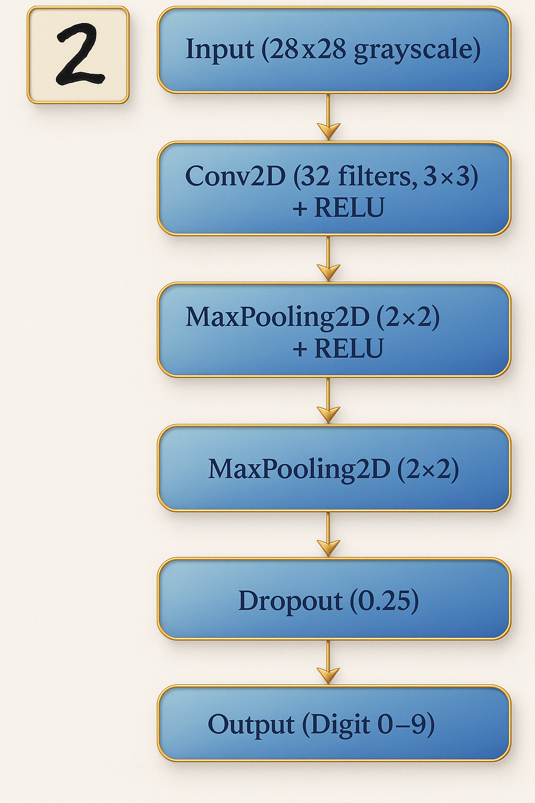
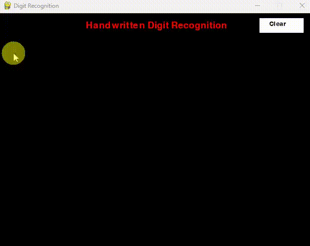

# 🧠 Handwritten Digit Recognition with Deep Learning

This project demonstrates a real-time handwritten digit recognition system using a Convolutional Neural Network (CNN), trained on the popular MNIST dataset and deployed using **Pygame**.

 <!-- Optional -->

---

## 📌 What is Handwritten Digit Recognition?

Handwritten Digit Recognition is a computer vision application that interprets human-written numbers (0-9) from images. It's often a beginner-friendly project in deep learning and is used in postal mail sorting, bank cheque verification, and digit-based form processing.

---

## 📊 Dataset

We use the **MNIST Dataset**, which contains:
- 60,000 training images
- 10,000 testing images
- Image size: 28x28 pixels, grayscale
- Digits: 0–9

---

## 🧠 Model Architecture

The model is a **Convolutional Neural Network (CNN)** consisting of:
- Two Conv2D layers with ReLU activation
- MaxPooling layers
- Dropout for regularization
- Dense layer with Softmax for classification


## 🧠 Architecture Diagram




## 🕹️ Live Demo App (Pygame)

Draw a digit in a GUI window and the model will predict it in real time using OpenCV and Pygame.




---

## 🛠️ Installation & Setup

```bash
# 1. Clone this repository
git clone https://github.com/YOUR_USERNAME/handwritten-digit-recognition.git
cd handwritten-digit-recognition

# 2. Create a virtual environment (recommended)
python -m venv venv
source venv/bin/activate  # On Windows: venv\Scripts\activate

# 3. Install dependencies
pip install -r requirements.txt

# 4. Run the digit recognition GUI
python app.py
